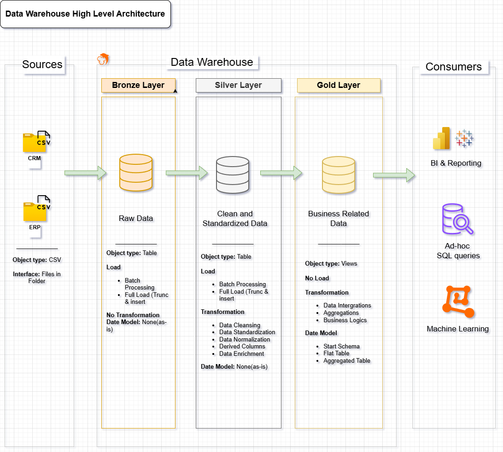
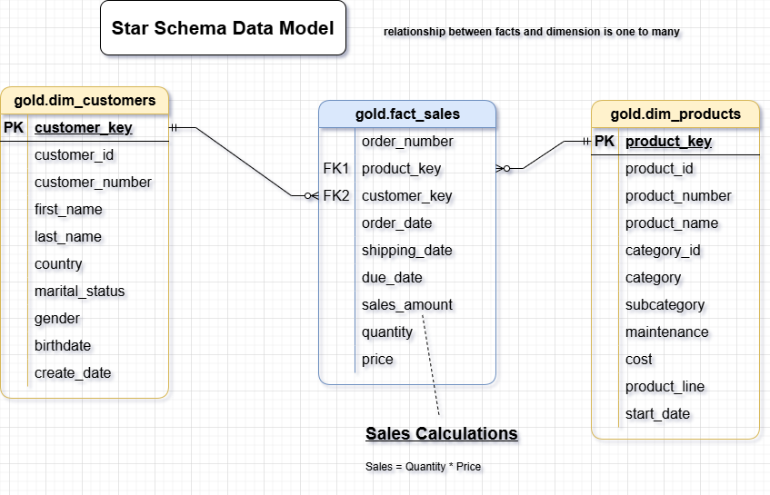

# 🏗️ SQL Data Warehouse Project

A end-to-end data warehousing project built with **MySQL**, 
following Medallion Architecture (Bronze → Silver → Gold layers).
## 🏗️ Data Architecture

## 🛠️ Tech Stack
- **MySQL** — Database & all SQL scripts
- **MySQL Workbench** — Query writing & DB management
- **Notion**-Creating a list of tasks
- **DrawIO** — Architecture diagrams
- **Git/GitHub** — Version control

> Note: This project was originally designed for SQL Server. 
> I independently adapted and implemented it in **MySQL**.

## Project Management & Planning
To organize the project workflow, I used Notion to plan milestones, tasks, and execution steps.
-[Notion_Plan](https://gaudy-powder-fd7.notion.site/SQL-Data-Warehouse-Project-3424c6e6879f80caa0b5c9ae547f74e6)

## 🏗️ Architecture — Medallion Layers
- **Bronze** — Raw ERP & CRM data loaded as-is from CSV files
- **Silver** — Data cleaning, deduplication, null handling, standardization
- **Gold** — Star schema (fact + dimension tables) ready for analytics

## 🔍 What I Did in the Silver Layer
- Detected and removed duplicate records
- Handled NULL and missing values
- Standardized inconsistent date and text formats
- Integrated ERP and CRM data into a unified model

## 📊 Analytics (Gold Layer)
SQL reports covering:
- Customer behavior analysis
- Product performance
- Sales trends over time

## ⭐ Star Schema (Gold Layer)

## 📚 Documentation
- [Silver Layer Data Catalog](docs/data_catalog_silver.md)
- [Gold Layer Data Catalog](docs/data_catalog_gold.md)
  
## 📂 Folder Structure
- `datasets/` — Raw CSV source files (ERP & CRM)
- `scripts/bronze/` — Raw data ingestion scripts
- `scripts/silver/` — Cleaning & transformation scripts  
- `scripts/gold/` — Star schema & analytics queries
- `docs/` — Architecture diagrams and data catalog
- `tests/` — Data quality checks

## 🔗 Connect With Me

